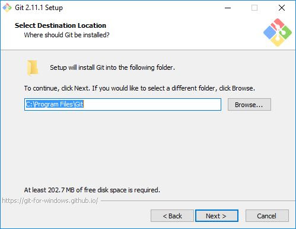
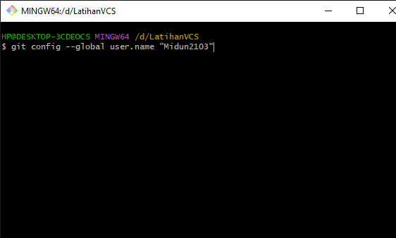

# Instalasi GIT dan Latihan menggunakan Version Control System
# - Instalasi GIT :
 1. Download git di link berikut : https://git-scm.com/downloads

 2. Berikut File Git yang sudah didownload lalu open :

     

 3. Maka akan muncul infomasi lisensi Git, klik Next > untuk melanjutkan.

     

 4. Selanjutnya menentukan lokasi instalasi. Biarkan saja apa adanya, kemudian klik Next >.

     

 5. Selanjutnya pemilihan komoponen, biarkan saja seperti ini kemudian klik Next >.

     

 6. Selanjutnya pemlilihan direktori start menu, klik Next >.

     

 7. Selanjutnya pengaturan PATH Environment. Pilih yang tengah agar perintah git dapat di kenali di Command       Prompt (CMD). Setelah itu klik Next >.

     
 8. Selanjutnya konversi line ending. Biarkan saja seperti ini, kemudian klik Next >.

     

 9. Selanjutnya pemilihan emulator terminal. Pilih saja yang bawah, kemudian klik Next >.

     

 10. Selanjutnya pemilihan opsi ekstra. Klik saja Next >.

     

 11. Selanjutnya pemilihan opsi ekspreimental, langsung saja klik Install untuk memulai instalasi.

     

 12. Tunggu beberapa saat, instalasi sedang dilakukan.

     

 13. Setelah selesai, kita bisa langsung klik Finish.

     

# Cara Pengguanan GIT :
 1. Pertama kita harus Konfigurasi global akun yaitu name dan email agar tidak eror ketika git commit :

       - git config --global user.name “name”
       - git config --global user.email "email"

     

     

 2. Membuat repository / folder baru dan masuk repository tersebut dengan masukan perintah sebagai berikut :

       - mkdir LatihanVCS
       - cd LatihanVCS

     

     

 3. Selanjutnya kita akan membuat file baru bernama README.md :

       - echo "# LatihanVCS" >> README.md

     

 4. Lalu kita inisialisasi dengan perintah berikut :

       - git init

     

 5. Setelah itu kita akan melihat status dari file tersebut :

       - git status

     

 6. Terlihat disitu terdapat file README.md yang belum di tambahkan yang bertulis dengan warna merah

    Untuk menambahkan file tersebut / perubahan pada file pada staging sebelum proses commit. ketikan perintah berikut

    Lalu cek kembali status file tersebut jika sudah sukses di tambahkan tulisan file berwarna hijau

       - git add "README.md"

       - git status

     

 7. Setelah itu simpan perubahan / penambahan yang terjadi dengan mengetikan perintah berikut :

       - git commit -m "first commit"

       - git remote -v => untuk mengecek sudah terhubung dengan url server git

     

    Perubahan / penambahan pada repository berhasil disimpan didatabse lokal, Jika kita ingin menyimpannya diserver repository silahkan kunjungi link berikut : https://github.com

 8. Lalu akan muncul tampilan sebagai berikut :
   
     

    Silahkan login jika sudah memiliki akun namun jika belum silahkan daftar terlebih dahulu :

 9.  Lalu akan muncul tampilan sebagai berikut silahkan daftar :

     

    Sampai semua ceklis berwarna hijau Jika sudah klik Continue

 10. Membuat Repository baru digithub klik tombol create or new yang berwarna hijau :

     

 11. Lalu akan tampil halaman berikut silahakan diisi nama repository sesuai keinginan kalian:

     
        - Public => repository dapat dilihat oleh semua orang
        - Private => repository dibatas tidak semua orang bisa melihat
 12. Jika Berhasil akan muncul tampilan sebagai berikut :

     

        - 1 Untuk menyimpan repository jika di komputer lokal belum ada
        - 2 Untuk membuat repository jika di komputer lokal sudah ada dan tersimpan kalian tinggal ikutin perintahnya
 13. Baik sekarang kita akan push repository lokal kita ke github pertama kita lakukan remote sebagai berikut :

        - git remote add origin https://github.com/adam-webdev/LatihanVCS.git
 Lalu cek status remote apakah berhasil :

      - git remote -v
 Lalu kita bisa atur branch repository kita dengan menjalankah perintah berikut :

      - git branch -M main

      

 14.   Selanjutnya kita push dengan menggunakan perintah :

      - git push -u origin main

      - origin adalah nama remote yang tadi kita buat

      - main adalah branch repository kita

     

